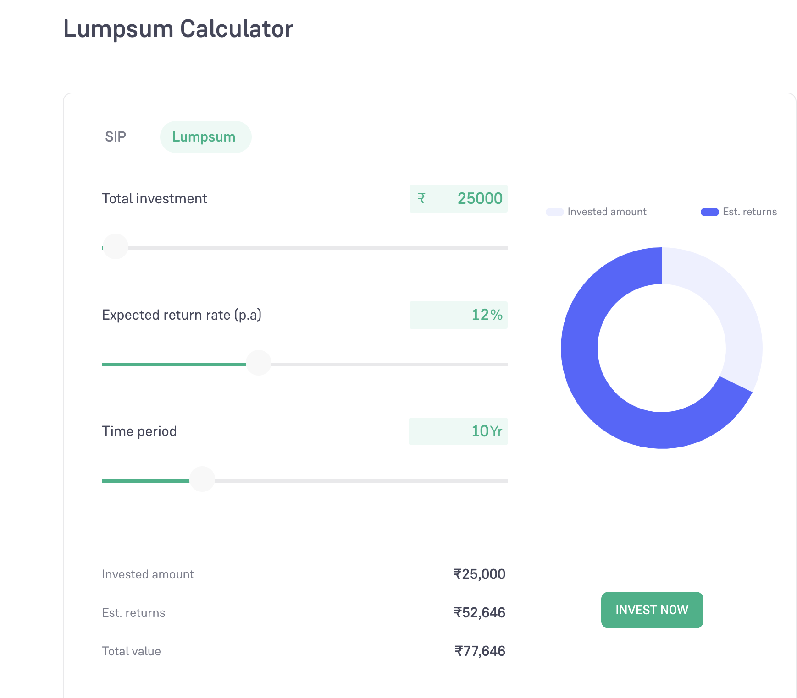

# Investment Calculator

* Inputs:
    * Principal
    * Interest rate
    * Time in years
* Output:
    * principal
    * Returns
    * Total Value
* Folmula
    * Total Value = `principal*(1+(interest_rate/100)/n)**(n*time_in_years)`
* Hint:
    * Usage: `python investment.py lumpsum <principal> <interest_rate> <time_in_years>`
* Future plan:
    * Usage: `python investment.py [investment_type] --principal 10000 --rate 18 --time 20`
            * investment_type = lumpsum
